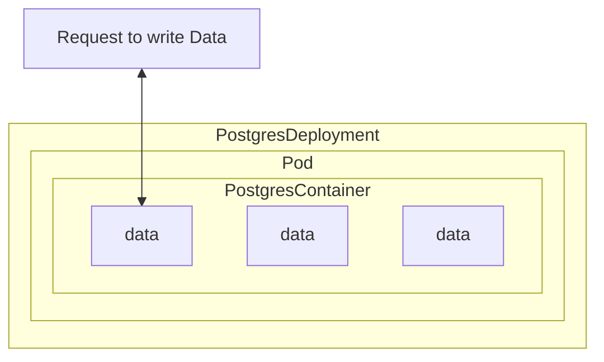
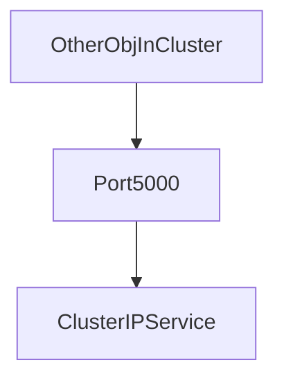

# Read Me


## Cleaning 

We first want to remove old deployments
```
kubectl get deployments
kube delete deployment client-deployment

kubectl get services
kubectl delete service client-node-port
```

## Apply

```
# We could use : 
kubectl apply -f k8s/client-deployment.yaml 

# But there is  a shortcut that will apply a group of config:
kubectl apply -f k8s
```

## Components

### Client

### Server

### Worker

Nothing in the worker image that needs to be accessible from anything else inside of the cluster. So, multi-worker does not need any port assigned to it.
 
### Redis

### Postgres

### Postgres PVC

## About configuration files

We do a separate configuration file for every object.
Alternativelly, we could regroup the configuration in one file using '---' line to separate.
However, makng separate files clearly tells you where to locate each object configuration, and how many objects are set.


 ## Glossary
**ClusterIP** : Expose *Service* through k8s cluster with ip/name:port. Services are reachable by pods/services in the Cluster. Not from client.

**NodePort** : Expose *Service* through *Internal network VM*. Services are reachable by clients on the same LAN/clients, only good for development env.

**LoadBalancer** : Expose *Service* through *External world*. Services are reachable by everyone connected to the internet. 

**PVC** : Persistent Volume Claim. The same type of volume used in the world of docker to share the file system of a host operating system or a host machine wit the file system inside of a container.

**Volume** :  To have a consistent file system that can be accessed by a database like postgres. Without volume, if postgres crashes, all the data is lost.
In the world of kubernetes, volume is a reference to a very particular type of object. We can write a configuration file. In k8s, this is an object that allows a container to store some persistend data at the pod level.
In addition of volumes, we also have 2 other types of data storage mechanisms: *PersistentVolumeClaim* and *PersistentVolume*. 

**PersistentVolume** : A volume not tied to a container nor a pod. So if a pod for some reason crashed, the data is not lost.

**PersistentVolumeClaim** : Compared to a *PersistentVolume*. Its an advertissement. Its an option that should be available.
Maybe be *statiscally provisioned persistent volume* ( = very specifically created ahead of time), or maybe *dynamically provisioned, persistent volume* (on the fly). 

**Secrets** : Securely store a piece of information in the cluster, such as a database password.
- Use an imperative command to create a secret such as: 
```
# From literal -> as opposed to from file
kuberctl create secret generic <secret_name> --from-literal key=value
(PGPASSWORD=12345)
```




